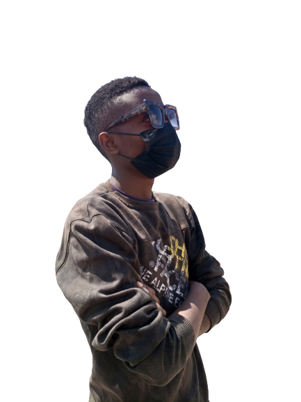

<table cellpadding="0">
  <tr style="padding: 0">
    <!-- GitHub Stats Card -->  
    <td valign="top"></td>
    <!-- GitHub Top Language Card -->
    <td valign="top">
	    
👋  Hello world!&nbsp;  🌍
	     
	  <em>Dev Ngecu here,A story waiting to be discovered.An awakened soul just moments away from living.The mind which happens to know little but is not afraid to learn.A simplified math equation, yet difficult to solve.
	 
	From very early on in my life, I started to fall in love with technology 😍 This love has helped me develop a very good technological mindset , and given me the curiosity to learn more. I firmly believe that **no amount of knowledge  is enough knowledge**. 🧠</em>
	    
 <samp>  </samp> 

  </tr>
</table>

<table cellpadding="0">
  <tr style="padding: 0">
    <!-- GitHub Stats Card -->  
    <td valign="top"></td>
    <!-- GitHub Top Language Card -->
    <td valign="top"></td>
  </tr>

</table>

  

	
	
<code></code>
<code></code>

<code></code>

<code></code>
<code></code>
<code></code>

  <h3 align="center">Connect with me</h3> 

 <a href="https://www.linkedin.com/in/robinson-ngecu-6a037688/" target="blank">
   &nbsp; &nbsp;
 </a>
 <a href="https://www.instagram.com/devngecu/" target="blank">
   &nbsp; &nbsp;
 </a>
 <a href="https://twitter.com/_ngecu_" target="blank">
   &nbsp; &nbsp;
 </a>
  
   
   
  Thanks for stopping by 😁 

Visit my profile and give a ⭐️ if you like it

